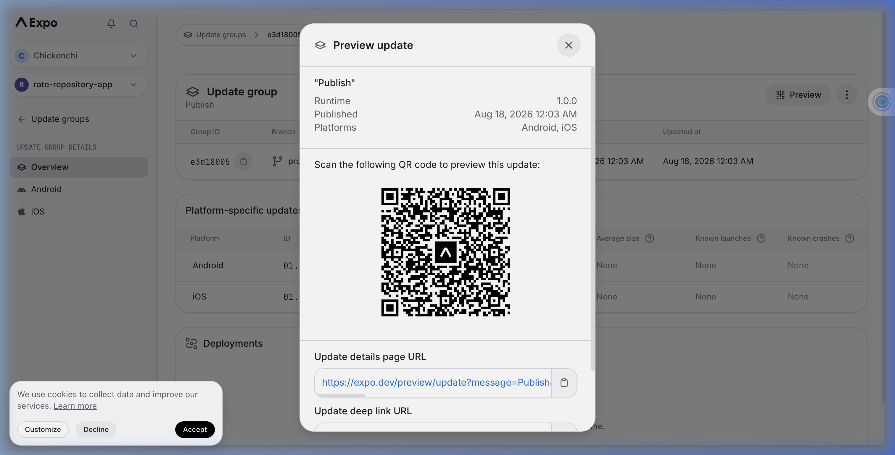

# Rate Repository Application

A mobile application for rating GitHub repositories, built with React Native, Expo, Apollo Client, and Formik as part of the Full Stack Open course (Part 10).

## 📱 Try the App on Your Phone

You can try the app on your phone by scanning the following QR code with Expo Go (Android) or the Camera app (iOS):



## 🛠️ Local Development Setup

To run the application locally:

1. **Install Dependencies:**
   ```bash
   cd part10/rate-repository-app
   npm install --legacy-peer-deps
   ```

2. **Environment Configuration:**
   Create a `.env` file in `part10/rate-repository-app/` and specify your backend GraphQL API URI:
   ```env
   EXPO_PUBLIC_APOLLO_URI=http://<YOUR_IP_ADDRESS>:4000/graphql
   ```

3. **Start Development Server:**
   ```bash
   npm start
   ```

4. **Running Tests:**
   ```bash
   npm test
   ```
